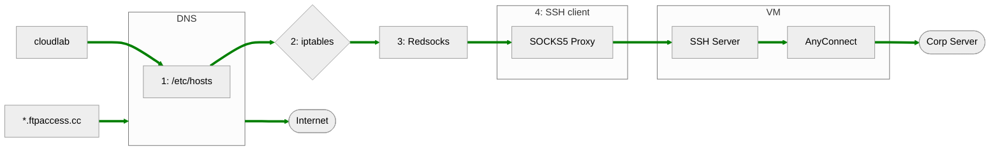

# Nix The World Pt 2

# :globe_showing_americas:

---

## :snowflake: Flakes :snowflake:
Converts inputs to outputs

---

## :snowflake: Flakes :snowflake:
```nix
{
  description = "A very basic flake";

  inputs = {
    nixpkgs.url = "github:nixos/nixpkgs?ref=nixos-unstable";
  };

  outputs = { self, nixpkgs }: {

    packages.x86_64-linux.hello = nixpkgs.legacyPackages.x86_64-linux.hello;
    packages.x86_64-linux.default = self.packages.x86_64-linux.hello;

  };
}
```

---

## :globe_with_meridians: OVPN :globe_with_meridians:



---

## :globe_with_meridians: OVPN :globe_with_meridians:

1. Write /etc/hosts entries
2. Apply iptable rules
3. Redirect VPN requests to redsocks instance
4. Create SOCKS5 Proxy running over SSH to VM

---

## :snowflake: Flakes :snowflake:


Notes:
Show OVPN flake.nix

---

## :robot: NixOS Config :robot:
### flake.nix
```nix[23-26|51-57]
{
  description = "NixOS configuration for yokley";

  inputs = {
    # Specify the source of Home Manager and Nixpkgs.
    nixpkgs.url = "github:nixos/nixpkgs/nixos-25.05";
    nixpkgs-unstable.url = "github:nixos/nixpkgs/nixos-unstable";
    home-manager = {
      url = "github:nix-community/home-manager/release-25.05";
      inputs.nixpkgs.follows = "nixpkgs";
    };
    nixvim = {
      url = "github:kyokley/nixvim";
    };
    qtile-flake = {
      url = "github:qtile/qtile/v0.33.0";
      inputs.nixpkgs.follows = "nixpkgs";
    };
    usql = {
      url = "github:kyokley/psql-pager";
      inputs.nixpkgs.follows = "nixpkgs";
    };
    ovpn-flake = {
      url = "git+ssh://git@cloudlab.us.oracle.com:2222/tpm/tpm_dev/playground/ovpn.git?ref=main";
      inputs.nixpkgs.follows = "nixpkgs";
    };
  };

  outputs = {
    nixpkgs,
    nixpkgs-unstable,
    home-manager,
    nixvim,
    qtile-flake,
    usql,
    ovpn-flake,
    ...
  }: let
    x86_linux = "x86_64-linux";
  in {
    nixosConfigurations = {
      "saturn" = nixpkgs.lib.nixosSystem {
        specialArgs = {
          pkgs-unstable = import nixpkgs-unstable {
            config.allowUnfree = true;
            system = x86_linux;
          };
        };
        modules = [
          (_: {nixpkgs.overlays = [qtile-flake.overlays.default];})
          ovpn-flake.nixosModules.default
          {
            ovpn = {
              enable = true;
              user = "yokley";
            };
          }
          ./programs/nixos/common-configuration.nix
          ./programs/nixos/hardware-configuration.nix
          ./hosts/saturn/configuration.nix
          ./hosts/saturn/hardware-configuration.nix
          home-manager.nixosModules.home-manager
          {
            home-manager.users.yokley = import ./hosts/saturn/saturn.nix;
            home-manager.extraSpecialArgs = {
              vars = import ./hosts/saturn/vars.nix;
              inherit nixvim;
              inherit usql;
              pkgs-unstable = import nixpkgs-unstable {
                config.allowUnfree = true;
                system = x86_linux;
              };
            };
            home-manager.useGlobalPkgs = true;
            home-manager.useUserPackages = true;
          }
        ];
      };
    };
  };
}
```
