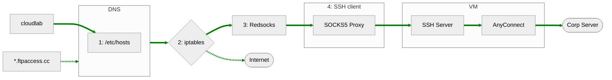
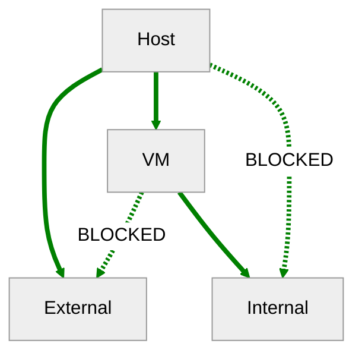

# Nix The World
# :globe_showing_americas:
# Part 3? <!-- .element: class="fragment" -->
### a.k.a. How I joined the cult of Nix <!-- .element: class="fragment" -->

Notes:
- The focus of this demo will be flake files specifically with respect to NixOS and not just Nix

---

## :snowflake: Flakes :snowflake:
```nix
{
  description = "A very basic flake";

  inputs = {
    nixpkgs.url = "github:nixos/nixpkgs?ref=nixos-unstable";
  };

  outputs = { self, nixpkgs }: {

    packages.x86_64-linux.hello = nixpkgs.legacyPackages.x86_64-linux.hello;
    packages.x86_64-linux.default = self.packages.x86_64-linux.hello;

  };
}
```

Notes:
- Previously it was asked if OVPN had a flake
    - it did not
- There was also a question about feasibility of using nix with cpm
    - these are my continuing investigations

- Recap flakes

---

## :building_construction: Flake Inputs :building_construction:
```nix
# A GitHub repository.
inputs.import-cargo = {
  type = "github";
  owner = "edolstra";
  repo = "import-cargo";
};

# An indirection through the flake registry.
inputs.nixpkgs = {
  type = "indirect";
  id = "nixpkgs";
};
```

Notes:
- Supports things like git, plain https, or even local files

---

## :factory: Flake Outputs :factory:
```nix[1-46|23-26]
{
  # Executed by `nix build .#<name>`
  packages."<system>"."<name>" = derivation;
  # Executed by `nix build .`
  packages."<system>".default = derivation;
  # Executed by `nix run .#<name>`
  apps."<system>"."<name>" = {
    type = "app";
    program = "<store-path>";
    meta = {description = "..."; inherit otherMetaAttrs; };
  };
  # Executed by `nix run . -- <args?>`
  apps."<system>".default = { type = "app"; program = "..."; meta = {description = "..."; inherit otherMetaAttrs; }; };

  # Formatter (alejandra, nixfmt, treefmt-nix or nixpkgs-fmt)
  formatter."<system>" = derivation;
  # Used for nixpkgs packages, also accessible via `nix build .#<name>`
  legacyPackages."<system>"."<name>" = derivation;
  # Overlay, consumed by other flakes
  overlays."<name>" = final: prev: { };
  # Default overlay
  overlays.default = final: prev: { };
  # Nixos module, consumed by other flakes
  nixosModules."<name>" = { config, ... }: { options = {}; config = {}; };
  # Default module
  nixosModules.default = { config, ... }: { options = {}; config = {}; };
  # Used with `nixos-rebuild switch --flake .#<hostname>`
  # nixosConfigurations."<hostname>".config.system.build.toplevel must be a derivation
  nixosConfigurations."<hostname>" = {};
  # Used by `nix develop .#<name>`
  devShells."<system>"."<name>" = derivation;
  # Used by `nix develop`
  devShells."<system>".default = derivation;
  # Hydra build jobs
  hydraJobs."<attr>"."<system>" = derivation;
  # Used by `nix flake init -t <flake>#<name>`
  templates."<name>" = {
    path = "<store-path>";
    description = "template description goes here?";
  };
  # Used by `nix flake init -t <flake>`
  templates.default = { path = "<store-path>"; description = ""; };
  # Executed by `nix flake check`
  checks."<system>"."<name>" = derivation;
}
```

Notes:
Call attention to the attributes options and config in nixosModules

---

## :globe_with_meridians: OVPN :globe_with_meridians:



-v-

## :globe_with_meridians: OVPN :globe_with_meridians:

1. Write /etc/hosts entries
2. Apply iptable rules
3. Redirect VPN requests to redsocks instance
4. Create SOCKS5 Proxy running over SSH to VM

---

## :snowflake: Flakes :snowflake:
#### OVPN: flake.nix
```nix[2-4|6|7|8-25|27-46]
{
  inputs = {
    nixpkgs.url = "github:NixOS/nixpkgs/nixos-unstable";
  };

  outputs = { self, nixpkgs, }: {
    nixosModules.default = { config, lib, pkgs, ... }: {
      options.ovpn = {
        enable = lib.mkOption {
          type = lib.types.bool;
          default = false;
          description = ''
            Whether to enable the ovpn service
          '';
        };

        user = lib.mkOption {
          type = lib.types.str;
          description = ''
            User to run services as
          '';
        };

        # trunc
      };

      config = lib.mkIf config.ovpn.enable {
          networking = {
            extraHosts = (
              lib.concatStringsSep "\n" (
                map (
                  host_record: let
                    host = lib.splitString " " host_record;
                  in "${lib.elemAt host 1} ${lib.elemAt host 0}"
                )
                domains
              )
            );
            firewall.allowedTCPPorts = [
              config.ovpn.redsocks-port
              config.ovpn.socks-port
            ];
          };
        # trunc
    };

}
```

Notes:
This example has been truncated, the actual file is 433 lines

Show actual file on cloudlab/scm

---

## :robot: NixOS Config :robot:
```nix[7-10|13|16-24]
{
  description = "NixOS configuration for yokley";

  inputs = {
    # Specify the source of Home Manager and Nixpkgs.
    nixpkgs.url = "github:nixos/nixpkgs/nixos-25.05";
    ovpn-flake = {
      url = "git+ssh://git@cloudlab.us.oracle.com:2222/tpm/tpm_dev/playground/ovpn.git?ref=main";
      inputs.nixpkgs.follows = "nixpkgs";
    };
  };

  outputs = { nixpkgs, ovpn-flake, ... }: {
    nixosConfigurations = {
      "machine" = nixpkgs.lib.nixosSystem {
        modules = [
          ovpn-flake.nixosModules.default
          {
            ovpn = {
              enable = true;
              user = "yokley";
            };
          }
        ];
      };
    };
  };
}
```

---

## :detective: Flakes Recap :detective:
* SSH client running SOCKS5 proxy <!-- .element: class="fragment" -->
* Spin up and configure a redsocks instance <!-- .element: class="fragment" -->
* Generate and apply a set of iptable rules <!-- .element: class="fragment" -->
* Insert entries into /etc/hosts <!-- .element: class="fragment" -->
* Everything implemented in systemd services on start up <!-- .element: class="fragment" -->
### ...all in 433 lines of code! <!-- .element: class="fragment" -->

Notes:
Are you not entertained??

---

## :snowflake: Flakes Rock! :snowflake:


Notes:
Inputs are pretty straightforward. They're just upstream dependencies

---

## Are we done yet?
# NO! <!-- .element: class="fragment" -->

Notes:
Of course not! Anything being distributed needs tests

---

## Tests for OS functionality???


---

## :thinking_face: Options :thinking_face:
- Bash
- Docker/Podman
- Ansible

Notes:
- Bash is brutal and you're probably only testing the local host
- It may be possible to run systemd in docker but not recommended because multiple processes
- Ansible spin up real compute instances in a VPS but costs money, teardown is a gamble, and juggling networking

---

## Ideal Test Case



---

## Demo


---

## :detective: Flakes Recap Again :detective:
* SSH client running SOCKS5 proxy
* Spin up and configure a redsocks instance
* Generate and apply a set of iptable rules
* Insert entries into /etc/hosts
* Everything implemented in systemd services on start up
* And tests! <!-- .element: class="fragment" -->
### ...still in 433 lines of code!

---

## Caveats
* The OVPN flake only controls the host
* Losing the SSH connection to the VM requires restarting SSH service
* No proxy settings are required for docker if host network is used

---

## Fin


Notes:
- Questions?
